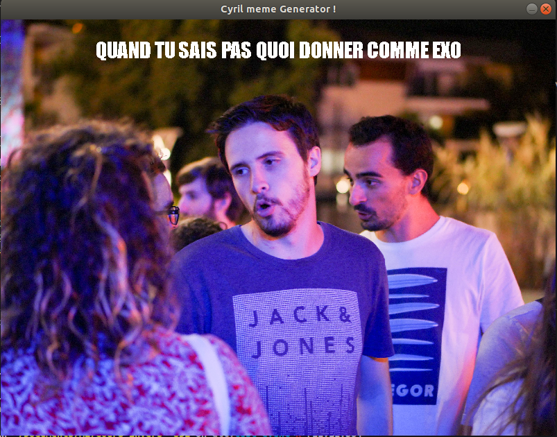

# Develop multimedia apps with SDL


Second year Bioinformatics Master degree

Software engineering -- Revers courses

JUNG Frédéric : frederic.jung@etu.u-bordeaux.fr

**Team:** Frederic - Pauline - Julien

----


# Tutorial: Cyril meme generator !

Clone this repo to create your own meme generator ! You may use this snippet and implement class and method to to display the image and text you want. Images sample are available in `/img` and fonts in `/fonts`.

# Excepted results





## Prerequisites

- Install Make

```
 apt-get install build-essential make
```


- Install SDL

```bash
sudo apt-get install libsdl1.2-dbg
```

[Install tutorial](https://wiki.libsdl.org/Installation)

- Install SDL2

```bash
apt-get install libsdl2-dev
```
[install tutorial](http://lazyfoo.net/tutorials/SDL/01_hello_SDL/linux/index.php)


## Usage

```bash
# Generate exec file
make

# run app
./main
```